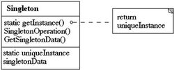

# 单例模式

* 定义

> 保证一个类仅有一个实例，并提供一个访问它的全局访问点。

这一模式的目的是使得类的一个对象成为系统中的唯一实例。要实现这一点，可以从客户端对其进行实例化开始。因此需要用一种只允许生成对象类的唯一实例的机制，“阻止”所有想要生成对象的访问。使用工厂方法来限制实例化过程。这个方法应该是静态方法（类方法），因为让类的实例去生成另一个唯一实例毫无意义。

* 结构图

* 要点 

    * 一是某个类只能有一个实例
    * 二是它必须自行创建这个实例
    * 三是它必须自行向整个系统提供这个实例。
    
    从具体实现角度来说:
    * 一是单例模式的类只提供私有的构造函数
    * 二是类定义中含有一个该类的静态私有对象
    * 三是该类提供了一个静态的公有的函数用于创建或获取它本身的静态私有对象。

* 代码
    
    1. 懒汉式写法
    
        [code](src/Singleton1.java)
        
        延迟创建和线程安全
        
        每次调用getInstance()时都必须进行同步，效率不佳。
    2. DCL（Double Check Lock） 双重校验锁
    
        [code](src/Singleton2.java)
        
        两次判空，第一次判空避免了不必要的同步，第二次保证了单例创建，这种方式比较不错，但是在高并发环境下有时会出现问题。
        
    3. 静态内部类单例模式
    
        [code](src/Singleton3.java)
    
        线程安全也保证了实例唯一